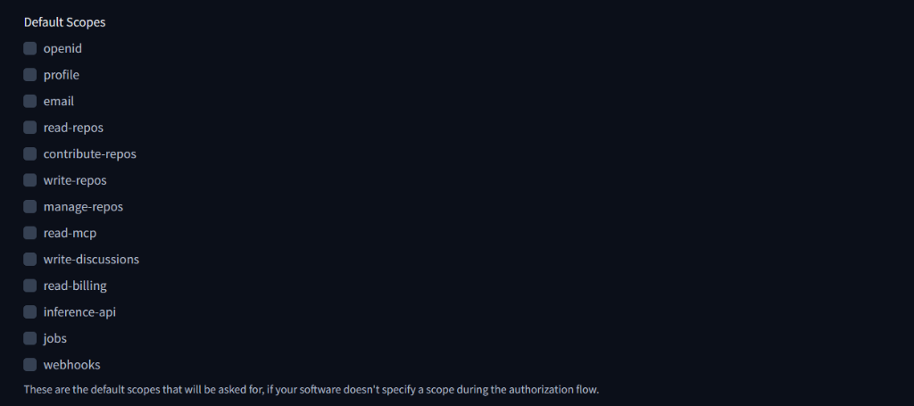

# GGUF Forge

A modern, glassmorphic FastAPI application to automate the conversion of HuggingFace models to GGUF format using `llama.cpp`.

> 🚀 **Don't want to self-host?** Use our free hosted service at **[gguforge.com](https://gguforge.com)** — no setup required! Just login with HuggingFace and request your conversions.

## Features

### Core Features
- **HuggingFace OAuth**: Guest login with HuggingFace for requesting conversions
- **Request System**: Users can request model conversions, admins approve/decline with reasons
- **Dashboard**: Real-time status of model conversions with detailed logs
- **Model Search**: Search HuggingFace models with autocomplete
- **Auto-Pipeline**: Download → Convert (FP16) → Quantize (All levels) → Upload
- **Async Processing**: Non-blocking quantization and concurrent uploads
- **Time Tracking**: Detailed timing stats for each conversion step
- **Version Tracking**: Auto-calculated version based on git commits
- **Llama.cpp Management**: Automatically clones and builds `llama.cpp`
- **Validation**: Checks disk space before processing
- **Responsive UI**: Glassmorphism design with real-time updates

### Task Management
- **Job Termination**: Admins can terminate any running conversion job mid-process
- **Startup Recovery**: Automatically detects and recovers stuck jobs after server crashes
- **Ticket System**: Conversational threads between users and admins for discussing requests
- **Discussion Workflow**: Instead of instant rejection, admins can start discussions with users

### Database Support
- **SQLite**: Default, zero-config local database
- **MSSQL**: Enterprise-grade Microsoft SQL Server support for production deployments

## Prerequisites
1.  **Python 3.10+**
2.  **Git**: Required for cloning llama.cpp and version tracking
3.  **Build Tools**:
    - **Windows**: Install [CMake](https://cmake.org/download/) and ensure `cmake` is in your PATH. You might also need Visual Studio Build Tools.
    - **Linux**: `sudo apt install build-essential cmake`

## Installation
1.  Clone the repository:
    ```bash
    git clone https://github.com/Akicuo/automaticConversion.git
    cd automaticConversion
    ```

2.  Create a virtual environment (recommended):
    ```bash
    python -m venv venv
    # Windows
    .\venv\Scripts\activate
    # Linux/Mac
    source venv/bin/activate
    ```

3.  Install dependencies:
    ```bash
    pip install -r requirements.txt
    ```

4.  Create a `.env` file with the required secrets (see Configuration below)

## Configuration

Create a `.env` file in the project root with the following variables:

### Required Secrets

#### HuggingFace Token
```env
HF_TOKEN=hf_xxxxxxxxxxxxxxxxxxxxxxxxxxxxx
```
- **Purpose**: Upload converted models to HuggingFace
- **How to get**: 
  1. Go to [HuggingFace Settings → Access Tokens](https://huggingface.co/settings/tokens)
  2. Create a new token with **Write** permissions
  3. Copy the token (starts with `hf_`)
- **Note**: Without this, models will be quantized but not uploaded

#### OAuth Configuration (for Guest Login)
```env
OAUTH_CLIENT_ID=your_oauth_client_id
OAUTH_CLIENT_SECRET=your_oauth_client_secret
OAUTH_REDIRECT_URI=http://localhost:8000/auth/callback
```
- **Purpose**: Enable HuggingFace OAuth login for guests to request conversions
- **How to get**:
  1. Go to [HuggingFace Settings → Connected Applications](https://huggingface.co/settings/connected-applications)
  2. Click "Create a new OAuth app"
  3. Fill in:
     - **Application name**: GGUF Forge (or your choice)
     - **Homepage URL**: `http://localhost:8000` (or your domain)
     - **Redirect URI**: `http://localhost:8000/auth/callback` (or your domain + `/auth/callback`)
     - **Scopes**: Select `openid`, `profile`, `email`
  4. Copy the **Client ID** and **Client Secret**

  
  *Ensure 'openid', 'profile', and 'email' are selected*

- **Note**: For production, update `OAUTH_REDIRECT_URI` to your actual domain

### Example `.env` File
```env
# HuggingFace Token (Required for uploads)
HF_TOKEN=hf_xxxxxxxxxxxxxxxxxxxxxxxxxxxxx

# OAuth Configuration (Required for guest login)
OAUTH_CLIENT_ID=your_oauth_client_id_here
OAUTH_CLIENT_SECRET=your_oauth_client_secret_here
OAUTH_REDIRECT_URI=http://localhost:8000/auth/callback

# Admin Users (HuggingFace usernames, comma-separated)
ADMIN_USERS=Akicuo,ungsung
```

### Admin Configuration
Instead of using a password-based admin account, admins are configured via the `ADMIN_USERS` environment variable:

```env
# Comma-separated list of HuggingFace usernames
ADMIN_USERS=Akicuo,ungsung,anotheruser
```

When these users login via HuggingFace OAuth, they automatically get admin privileges. This means:
- No need to remember separate admin credentials
- Easy to add/remove admins by updating `.env` and restarting
- Role is updated on each login (so changes take effect immediately)

### Optional Configuration
You can also set these environment variables (they have defaults):
- `PORT`: Server port (default: 8000)
- `HOST`: Server host (default: 0.0.0.0)
- `PARALLEL_QUANT_JOBS`: Number of simultaneous quantization jobs (default: 2)
  - `1` = Sequential (original behavior, slowest but safest)
  - `2` = Default (balanced, recommended for most systems)
  - `4` = Aggressive (fastest on high-end systems with 16+ cores and fast NVMe)
  - **Performance Notes**:
    - Each job gets an equal share of CPU cores (e.g., 16 cores ÷ 2 jobs = 8 cores each)
    - Higher values speed up conversion but require more RAM and may cause CPU/IO contention
    - Recommended: `2` for 8-16 cores, `4` for 24+ cores with 64GB+ RAM

### Database Configuration

GGUF Forge supports two database backends: **SQLite** (default) and **MSSQL**.

#### SQLite (Default)
No configuration needed. A local `gguf_app.db` file is created automatically.

#### MSSQL Server
To use MSSQL instead of SQLite, add these variables to your `.env`:

```env
# Database type: "sqlite" (default) or "mssql"
DB_TYPE=mssql

# MSSQL Configuration
MSSQL_HOST=your-server.database.net
MSSQL_PORT=1433
MSSQL_DATABASE=gguforge
MSSQL_USER=your_username
MSSQL_PASSWORD=your_password
MSSQL_ENCRYPT=yes
MSSQL_TRUST_CERT=yes
```

**Prerequisites for MSSQL:**
1. Install the ODBC Driver for SQL Server:
   - **Windows**: Download from [Microsoft](https://docs.microsoft.com/en-us/sql/connect/odbc/download-odbc-driver-for-sql-server)
   - **Linux (Ubuntu/Debian)**:
     ```bash
     curl https://packages.microsoft.com/keys/microsoft.asc | sudo apt-key add -
     curl https://packages.microsoft.com/config/ubuntu/$(lsb_release -rs)/prod.list | sudo tee /etc/apt/sources.list.d/mssql-release.list
     sudo apt-get update
     sudo ACCEPT_EULA=Y apt-get install -y msodbcsql17
     ```
   - **WSL (Windows Subsystem for Linux)**:
     ```bash
     # First install unixODBC (required for pyodbc)
     sudo apt-get update
     sudo apt-get install -y unixodbc unixodbc-dev
     
     # Add Microsoft repository
     curl https://packages.microsoft.com/keys/microsoft.asc | sudo apt-key add -
     curl https://packages.microsoft.com/config/ubuntu/$(lsb_release -rs)/prod.list | sudo tee /etc/apt/sources.list.d/mssql-release.list
     
     # Install ODBC Driver 17
     sudo apt-get update
     sudo ACCEPT_EULA=Y apt-get install -y msodbcsql17
     
     # Verify installation
     odbcinst -q -d -n "ODBC Driver 17 for SQL Server"
     
     # Reinstall pyodbc (may be needed after installing ODBC)
     pip install --force-reinstall pyodbc
     ```
   - **macOS**:
     ```bash
     # Install Homebrew if not installed
     /bin/bash -c "$(curl -fsSL https://raw.githubusercontent.com/Homebrew/install/HEAD/install.sh)"
     
     # Install unixODBC and ODBC Driver
     brew install unixodbc
     brew tap microsoft/mssql-release https://github.com/Microsoft/homebrew-mssql-release
     brew update
     HOMEBREW_ACCEPT_EULA=Y brew install msodbcsql17
     ```

2. Install pyodbc (already in requirements.txt):
   ```bash
   pip install pyodbc
   ```

> **💡 Tip:** If you don't need MSSQL, just use SQLite! Set `DB_TYPE=sqlite` in your `.env` file (or remove the line entirely) - no additional dependencies required.

**Testing Connection:**
After configuration, verify with:
```bash
curl http://localhost:8000/api/health
```

Response shows database status:
```json
{
  "status": "healthy",
  "database": {
    "type": "mssql",
    "connected": true,
    "message": "Successfully connected to mssql database"
  }
}
```

## Usage

### Starting the Application
1.  Start the app:
    ```bash
    python app_gguf.py
    ```

2.  **First Run**: Check the console output! It will print your **Admin Username** and **Password**. These credentials are also saved to `creds.txt`.

3.  Open [http://localhost:8000](http://localhost:8000)

### User Roles

#### Guest Users
- Can browse the dashboard and view active conversions
- Can request model conversions (requires HuggingFace OAuth login)
- Can view their request history with status and decline reasons

#### Authenticated Users (via HuggingFace OAuth)
- All guest permissions
- Can submit conversion requests
- View request status (pending/approved/rejected)
- See decline reasons if requests are rejected

#### Admin Users
- All user permissions
- Can directly start model conversions
- View and manage all pending requests
- Approve or decline requests with optional reasons
- Access to full system controls

### Converting a Model

#### As Admin:
1. Login at `/login` with admin credentials
2. Search for a model (e.g., `TinyLlama/TinyLlama-1.1B-Chat-v1.0`)
3. Click **Start** to begin conversion immediately

#### As Guest/User:
1. Click **Login** and choose "Continue with HuggingFace"
2. Authorize the application
3. Search for a model
4. Click **Request** to submit a conversion request
5. Wait for admin approval
6. Check "My Requests" section for status updates

## Conversion Pipeline

Each conversion goes through these steps:

1. **Setup** (10%): Clone and build llama.cpp
2. **Download** (30%): Download model from HuggingFace
3. **Convert** (50%): Convert to FP16 GGUF format
4. **Quantize** (80%): Create all quantization levels in parallel (Q2_K, Q3_K_S, Q3_K_M, Q3_K_L, Q4_0, Q4_K_S, Q4_K_M, Q5_0, Q5_K_S, Q5_K_M, Q6_K, Q8_0)
5. **Upload** (90%): Concurrent upload of all quants to HuggingFace
6. **README** (100%): Generate and upload README with stats

### Conversion Stats
Each conversion tracks:
- **Job ID**: Unique identifier for the conversion
- **Version**: GGUF Forge version (auto-calculated from git commits)
- **Total Time**: Complete pipeline duration
- **Avg Time per Quant**: Average quantization time
- **Step Breakdown**: Individual timing for each step

## Notes
- The first conversion will take longer as it clones and builds `llama.cpp`
- Ensure you have enough disk space. A 7B model requires ~15GB for download + ~15GB for FP16 + ~5-10GB per quant
- All conversions run asynchronously and won't block the server
- Quantizations run in parallel (configurable via `PARALLEL_QUANT_JOBS`, default: 2 simultaneous jobs)
- Uploads are concurrent (4 at a time) for faster completion
- Files are automatically cleaned up after upload

## Troubleshooting

### OAuth Not Working
- Verify `OAUTH_CLIENT_ID` and `OAUTH_CLIENT_SECRET` are correct
- Check that the redirect URI in HuggingFace matches `OAUTH_REDIRECT_URI` in `.env`
- Ensure the OAuth app has the correct scopes (`openid`, `profile`, `email`)

### Models Not Uploading
- Verify `HF_TOKEN` is set and has **Write** permissions
- Check the token hasn't expired
- Ensure you have permission to create repositories on HuggingFace

### Build Errors
- **Windows**: Install Visual Studio Build Tools and CMake
- **Linux**: Install `build-essential` and `cmake`
- Check that `git` is installed and in PATH

### MSSQL Connection Issues
- Ensure ODBC Driver 17 for SQL Server is installed
- Verify server allows remote connections
- Check firewall rules for the MSSQL port
- Test connection with: `curl http://localhost:8000/api/health`

## Admin Features

### Job Termination
Admins can terminate any running conversion job:
1. Find the job in the "Conversion Queue" section
2. Click the orange **Terminate** button
3. The job will stop and be marked as "TERMINATED"

Jobs terminated mid-process can be restarted by re-approving the original request.

### Ticket/Discussion System
Instead of instantly rejecting requests, admins can start discussions:

1. **Starting a Discussion**: Click "Discuss" on a pending request
2. **Admin Dashboard**: View all active discussions in the "Active Discussions" section
3. **Conversation**: Both admin and user can exchange messages
4. **Resolution**: Admin can either:
   - **Approve**: Start the conversion
   - **Close**: Reject the request

Users see their discussions in "My Requests" with a "View Thread" button.

### Startup Recovery
If the server crashes during a conversion:
- On restart, stuck jobs are automatically marked as "INTERRUPTED"
- Associated requests are reset to "PENDING" for re-approval
- No manual intervention required

## API Reference

### Public Endpoints
| Endpoint | Method | Description |
|----------|--------|-------------|
| `/api/health` | GET | Health check with database status |
| `/api/hf/search?q=query` | GET | Search HuggingFace models |
| `/api/status/all` | GET | Get all conversion jobs |

### Authenticated Endpoints
| Endpoint | Method | Description |
|----------|--------|-------------|
| `/api/requests/submit` | POST | Submit a conversion request |
| `/api/requests/my` | GET | Get user's requests |
| `/api/tickets/my` | GET | Get user's tickets |
| `/api/tickets/{id}/messages` | GET | Get ticket messages |
| `/api/tickets/{id}/reply` | POST | Reply to a ticket |
| `/api/tickets/{id}/reopen` | POST | Reopen a closed ticket |

### Admin Endpoints
| Endpoint | Method | Description |
|----------|--------|-------------|
| `/api/models/process` | POST | Start a conversion directly |
| `/api/models/{id}/terminate` | POST | Terminate a running job |
| `/api/requests/all` | GET | View all requests |
| `/api/requests/{id}/approve` | POST | Approve a request |
| `/api/requests/{id}/reject` | POST | Reject a request |
| `/api/tickets/create` | POST | Create a discussion ticket |
| `/api/tickets/all` | GET | View all tickets |
| `/api/tickets/{id}/approve` | POST | Approve from ticket |
| `/api/tickets/{id}/close` | POST | Close/reject a ticket |
| `/api/admin/db-info` | GET | Database information |

## Project Structure

```
automaticConversion/
├── app_gguf.py          # Main FastAPI application
├── database.py          # Database abstraction (SQLite + MSSQL)
├── security.py          # Rate limiting, bot detection, spam protection
├── models.py            # Pydantic request/response models
├── managers.py          # LlamaCpp and HuggingFace managers
├── workflow.py          # Model conversion pipeline
├── routes/
│   ├── auth.py          # Authentication (admin login + OAuth)
│   ├── models.py        # Model processing endpoints
│   ├── requests.py      # Request system endpoints
│   └── tickets.py       # Ticket/discussion endpoints
├── static/
│   ├── js/
│   │   └── tickets.js   # Ticket modal JavaScript
│   └── favicon.png
├── templates/
│   ├── base.html        # Base template
│   ├── index.html       # Main dashboard
│   └── login.html       # Admin login page
├── .env.example         # Environment template
└── requirements.txt     # Python dependencies
```

## License
MIT

## Credits
- [llama.cpp](https://github.com/ggerganov/llama.cpp) - GGUF quantization
- [HuggingFace](https://huggingface.co) - Model hosting and OAuth
- [FastAPI](https://fastapi.tiangolo.com/) - Web framework
- [pyodbc](https://github.com/mkleehammer/pyodbc) - MSSQL connectivity
